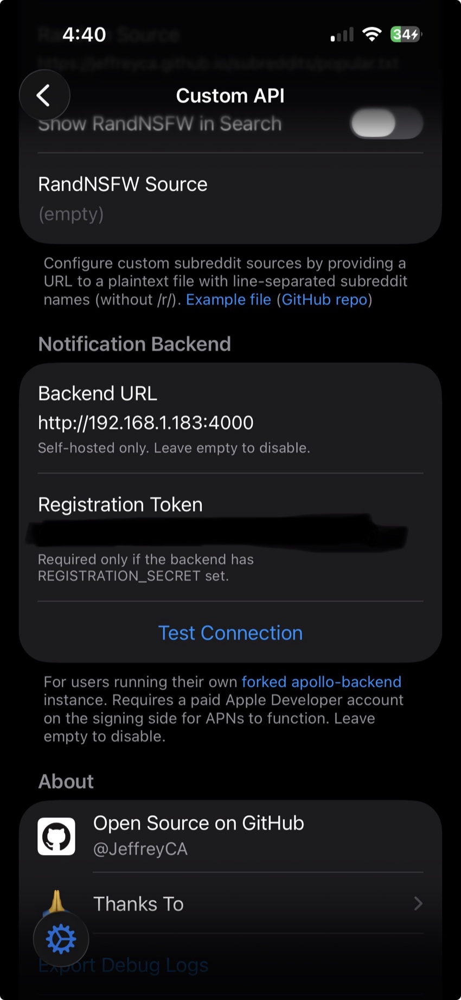
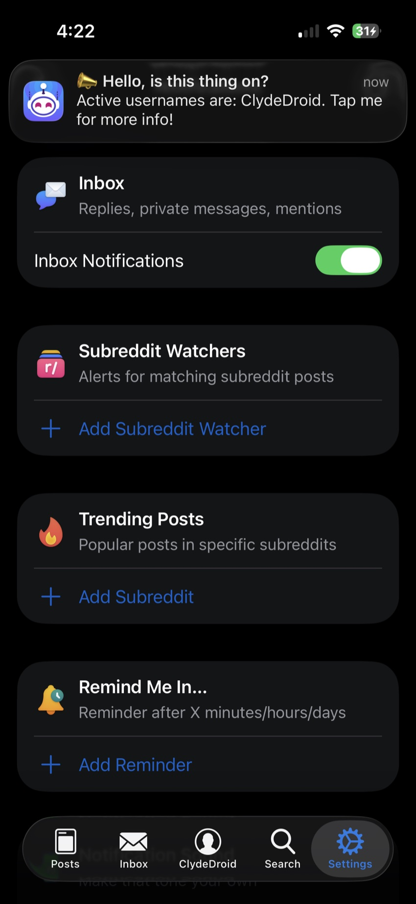
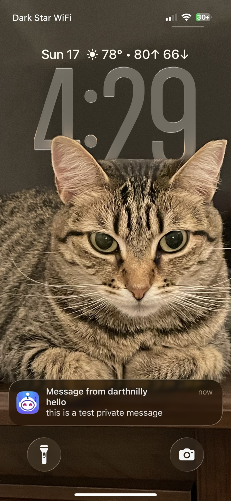
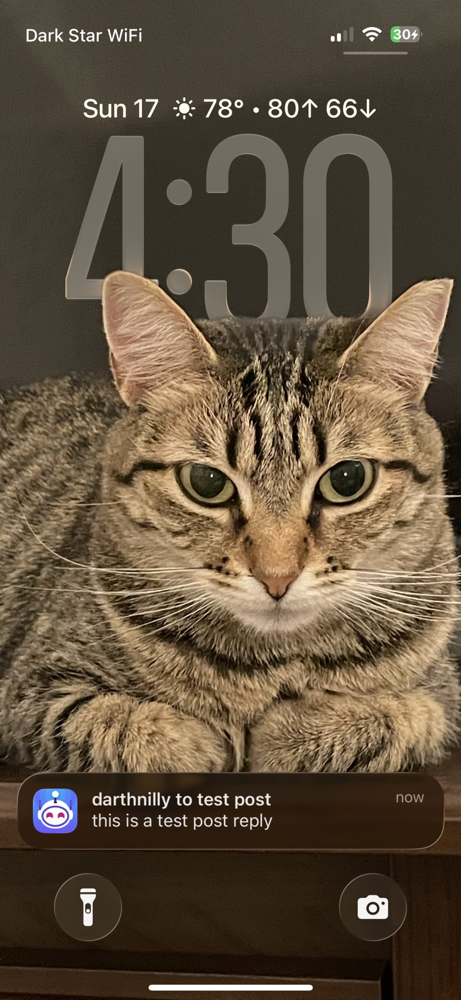

# Getting Started

A complete, beginner-friendly walkthrough that takes you from **nothing installed** to **a test
push landing on your iPhone** — and then, optionally, to a setup that works anywhere you go and
keeps running for the long haul.

This guide assumes no prior experience with Docker or the Apple Developer portal. Every command is
copy-pasteable. If you already know Docker, the [Quickstart in the README](README.md#quickstart-with-docker)
is the fast path; this is the long, hand-holding version.

> **Time & cost:** plan for **30–60 minutes**, plus a one-time **$99/year** for the Apple Developer
> Program (there is no way around this — see [prerequisites](#0-what-youre-building--what-youll-need)).

## Table of contents

- [0. What you're building & what you'll need](#0-what-youre-building--what-youll-need)
- [1. Install Docker](#1-install-docker)
- [2. Get the code](#2-get-the-code)
- [3. Set up Apple: App ID, APNs key, Team ID](#3-set-up-apple-app-id-apns-key-team-id)
- [4. Place the key & configure your environment](#4-place-the-key--configure-your-environment)
- [5. Start the backend](#5-start-the-backend)
- [6. Point the app at your backend & enable notifications](#6-point-the-app-at-your-backend--enable-notifications)
- [7. Verify end-to-end (a real push)](#7-verify-end-to-end-a-real-push)
- [8. (Optional) Open it up to the internet](#8-optional-open-it-up-to-the-internet)
- [9. Keep it running long-term](#9-keep-it-running-long-term)
- [10. Troubleshooting](#10-troubleshooting)

---

## 0. What you're building & what you'll need

The original [Apollo for Reddit](https://apolloapp.io/) app had a backend that delivered push
notifications (inbox replies, mentions) and ran subreddit/user *watchers*. That backend was shut
down in 2023. **This project is a self-hostable revival of it.**

Paired with **[the Apollo-Reborn tweak](https://github.com/Apollo-Reborn/Apollo-Reborn)**
(the tweak that lets a sideloaded Apollo build use *your own* Reddit credentials), running this
backend brings notifications and watchers back to life. You run one copy of this backend for
yourself (and optionally a few friends on the same build) — it's **single-tenant by design**.

```
  ┌─────────────┐     push      ┌──────────┐     APNs      ┌─────────────┐
  │  Reddit API │ ───────────▶  │   THIS   │ ───────────▶  │  Apple/APNs │ ──▶ 📱 your iPhone
  └─────────────┘   (watched)   │ BACKEND  │   (notif)     └─────────────┘
                                 └──────────┘
                                  Docker on your
                                  Mac / server / VPS
```

### Hard prerequisites (don't skip these)

These five things are **required**. Skipping any of them produces failures that look like backend
bugs but aren't — so confirm each one before you start.

1. **A paid Apple Developer account ($99/year).** Apple only grants the push-notification
   entitlement (`aps-environment`) to paid teams. With a *free* account you can register devices and
   everything looks fine, but **the pushes never arrive**. Sign up at
   [developer.apple.com/programs](https://developer.apple.com/programs/).

2. **Your own custom bundle ID — never `com.christianselig.Apollo`.** Reddit's edge firewall blocks
   the original Apollo bundle ID: any request whose User-Agent contains that string gets a `403`
   "blocked by network security" page. You must re-sign your build under your own ID (e.g.
   `com.yourname.Apollo`) and use that ID *everywhere*.

3. **An explicit App ID with Push Notifications enabled** at developer.apple.com — **not** the
   wildcard profile that sideloading tools (like Sideloadly) create by default. Push capability
   isn't available on wildcard profiles, so the entitlement ends up silently missing and Apple drops
   every notification. (You'll create this App ID in [Step 3](#3-set-up-apple-app-id-apns-key-team-id).)

4. **A sideloaded Apollo build re-signed under that bundle ID, with the
   [Apollo-Reborn tweak](https://github.com/Apollo-Reborn/Apollo-Reborn) installed**
   and its Reddit Custom API already working (i.e. you can already browse Reddit in the app using
   your own API key). This guide picks up *after* that part is working.

5. **A machine to run the backend on that stays powered on** — a home server, an always-on Mac, a
   mini-PC, a Raspberry Pi, or a cloud VPS. For notifications to keep arriving, this machine and its
   Docker containers need to keep running.

---

## 1. Install Docker

The backend ships as a set of Docker containers, so the only thing you install on the host is Docker
itself. Pick your platform.

<details open>
<summary><strong>macOS</strong></summary>

1. Download **Docker Desktop** from
   [docker.com/products/docker-desktop](https://www.docker.com/products/docker-desktop/) (choose the
   Apple Silicon or Intel build to match your Mac).
2. Open the `.dmg` and drag **Docker** into **Applications**.
3. Launch Docker from Applications and let it finish starting (the whale icon in the menu bar stops
   animating when it's ready). Accept the permission prompts.
4. For long-term stability, open **Docker Desktop → Settings → General** and enable **"Start Docker
   Desktop when you sign in"** so the backend comes back after a reboot.
5. Verify in Terminal:
   ```bash
   docker --version
   docker compose version
   ```
   Both should print a version number.

</details>

<details>
<summary><strong>Linux</strong> (recommended for an always-on server)</summary>

1. Install Docker Engine + the Compose plugin with the official convenience script:
   ```bash
   curl -fsSL https://get.docker.com | sh
   ```
   (Or follow your distro's instructions at [docs.docker.com/engine/install](https://docs.docker.com/engine/install/).)
2. Let your user run Docker without `sudo`:
   ```bash
   sudo usermod -aG docker $USER
   # log out and back in (or run: newgrp docker) for this to take effect
   ```
3. Make sure Docker starts on boot — essential for an unattended server:
   ```bash
   sudo systemctl enable --now docker
   ```
4. Verify:
   ```bash
   docker --version
   docker compose version
   ```

</details>

<details>
<summary><strong>Windows</strong></summary>

Install **Docker Desktop** with the **WSL 2** backend — follow
[docs.docker.com/desktop/install/windows-install](https://docs.docker.com/desktop/install/windows-install/).
Then run the rest of this guide's commands from a WSL 2 terminal (Ubuntu). The commands are
identical to the Linux/macOS ones. Windows isn't the recommended host for an always-on deployment —
a Linux box or VPS is sturdier — but it works for testing.

</details>

---

## 2. Get the code

Clone the repository and move into it:

```bash
git clone https://github.com/Apollo-Reborn/apollo-backend
cd apollo-backend
```

You **do not need Go or any build tools.** The bundled `docker-compose.yml` pulls a prebuilt image
from GitHub Container Registry (`ghcr.io/apollo-reborn/apollo-backend`) automatically.

> **Only if you fork and change the code:** you'll need to build your own image instead of pulling.
> Use `make docker-build` (or `docker compose up -d --build`). Note that `docker compose up` reuses
> the cached image, so **code changes require `--build`** to take effect. You can also point
> `APOLLO_IMAGE` at your own registry. Most people running this as-is can ignore all of that.

---

## 3. Set up Apple: App ID, APNs key, Team ID

This is the part the rest of the documentation assumes you already know. Here it is in full. You'll
do all of this at **[developer.apple.com/account](https://developer.apple.com/account)**.

By the end you'll have collected four things:

| What | Example | Where it's used |
|---|---|---|
| **Bundle ID** | `com.yourname.Apollo` | `APPLE_APNS_TOPIC`, app signing, Reddit UA |
| **APNs key file** | `AuthKey_ABC123XYZ9.p8` | dropped into `secrets/apple.p8` |
| **Key ID** | `ABC123XYZ9` | `APPLE_KEY_ID` |
| **Team ID** | `A1B2C3D4E5` | `APPLE_TEAM_ID` |

### 3a. Enroll in the Apple Developer Program

If you haven't already, enroll at
[developer.apple.com/programs](https://developer.apple.com/programs/) ($99/year). Approval can take
anywhere from a few minutes to ~48 hours. You cannot create an App ID or APNs key until enrollment
is active.

### 3b. Create an App ID with Push Notifications enabled

1. Go to [Certificates, Identifiers & Profiles → Identifiers](https://developer.apple.com/account/resources/identifiers/list).
2. Click the blue **➕** next to "Identifiers".
3. Select **App IDs** → **Continue**, then choose type **App** → **Continue**.
4. Fill in:
   - **Description**: anything, e.g. `My Apollo`.
   - **Bundle ID**: choose **Explicit** and enter your custom ID, e.g. `com.yourname.Apollo`.
     ⚠️ **Do not use `com.christianselig.Apollo`** (Reddit blocks it). This must be the *same* bundle
     ID you used to re-sign the app.
5. Scroll down the **Capabilities** list and tick **Push Notifications**.
6. Click **Continue**, then **Register**.

### 3c. Create an APNs Auth Key (the `.p8` file)

1. Go to [Certificates, Identifiers & Profiles → Keys](https://developer.apple.com/account/resources/authkeys/list).
2. Click the blue **➕**.
3. Give the key a **name** (e.g. `Apollo APNs`).
4. Tick **Apple Push Notifications service (APNs)**.
5. Click **Continue**, then **Register**.
6. On the next page:
   - **Copy the Key ID** shown (a 10-character string like `ABC123XYZ9`) — this is your
     `APPLE_KEY_ID`.
   - Click **Download**. You get a file named `AuthKey_XXXXXXXXXX.p8`.

   > ⚠️ **You can only download this file once.** Apple will never let you re-download it. Save it
   > somewhere safe. (If you lose it, you just revoke the key and make a new one — no harm, but you
   > can't recover the old file.)

One APNs key works for all your apps and doesn't expire, so you only ever do this once.

### 3d. Find your Team ID

Your **Team ID** is a 10-character string shown:
- in the top-right corner of the developer portal, under your account name, **and**
- on the [Membership details](https://developer.apple.com/account/#/membership) page.

Copy it — this is your `APPLE_TEAM_ID`.

---

## 4. Place the key & configure your environment

### 4a. Drop the APNs key into the project

From the `apollo-backend` directory:

```bash
mkdir -p secrets
cp ~/Downloads/AuthKey_XXXXXXXXXX.p8 secrets/apple.p8
```

(Adjust the path to wherever your downloaded `.p8` is.) The compose stack mounts this read-only at
`/etc/secrets/apple.p8` inside the containers, which is the default `APPLE_KEY_PATH` — so the
filename **must** be `secrets/apple.p8`.

### 4b. Create your environment file

```bash
cp .env.docker.example .env.docker
```

Now open `.env.docker` in any text editor and fill in these values:

| Variable | Set it to |
|---|---|
| `APPLE_KEY_ID` | Your Key ID from [3c](#3c-create-an-apns-auth-key-the-p8-file) (e.g. `ABC123XYZ9`). |
| `APPLE_TEAM_ID` | Your Team ID from [3d](#3d-find-your-team-id) (e.g. `A1B2C3D4E5`). |
| `APPLE_APNS_TOPIC` | **Your bundle ID** (e.g. `com.yourname.Apollo`). ⚠️ The example file ships with `com.christianselig.Apollo` as a placeholder — **you must change it**, or every Reddit call gets blocked. |
| `APPLE_APNS_SANDBOX` | `true` — sideloaded builds signed with a development certificate need the **sandbox** APNs gateway. Leaving this off is the most common cause of `BadDeviceToken`. |
| `REGISTRATION_SECRET` | A long random string of your choosing (e.g. the output of `openssl rand -hex 24`). This stops strangers from registering against your backend. Optional on a private LAN, **strongly recommended before you expose anything to the internet** ([Step 8](#8-optional-open-it-up-to-the-internet)). |

**About the Reddit credentials (`REDDIT_CLIENT_ID`, `REDDIT_CLIENT_SECRET`, `REDDIT_REDIRECT_URI`,
`REDDIT_USER_AGENT`):** you almost certainly already configured these inside the tweak's **Custom
API** screen when you got Reddit browsing working — the tweak sends them to the backend
automatically at registration time. These env vars are a **fallback** the backend uses if the tweak
fails to inject them. For a single-user setup it's harmless (and a good safety net) to fill them in
here too. If you do, the **User Agent must follow Reddit's format**, including your username:
`ios:com.yourname.Apollo:v1.0 (by /u/yourusername)`. You can review/create Reddit API credentials at
[reddit.com/prefs/apps](https://www.reddit.com/prefs/apps); see the
[tweak's README](https://github.com/Apollo-Reborn/Apollo-Reborn) for the recommended setup.

**Leave these defaults alone** (they're already correct for the bundled stack):
- `APPLE_KEY_PATH` stays `/etc/secrets/apple.p8`.
- The Postgres and Redis URLs point at the built-in containers. ⚠️ Don't append a query string (like
  `?sslmode=disable`) to `DATABASE_CONNECTION_POOL_URL` — the app appends its own `?pool_max_conns=…`
  and a second `?` makes the database driver reject the URL.

---

## 5. Start the backend

Bring the whole stack up in the background:

```bash
make docker-up      # same as: docker compose up -d
```

Then follow the logs until things settle:

```bash
make docker-logs    # Ctrl-C to stop following; the containers keep running
```

This starts everything the backend needs, each in its own container:
- **postgres** + **pgbouncer** — the database and its connection pooler
- **redis-queue** + **redis-locks** — two Redis instances (job queue and dedup locks)
- **migrate** — a one-shot that creates the database schema, then exits
- **api** — the HTTP server (port **4000**) the app talks to
- **scheduler** — decides what to check and when
- **worker-notifications / -subreddits / -trending / -users / -stuck-notifications** — do the work

### Confirm it's healthy

```bash
curl http://localhost:4000/v1/health
```

You should get:

```json
{"status":"available"}
```

🎉 If you see that, the backend is up.

> **If the `api` container keeps restarting:** it's almost always a missing Apple value or an
> unreadable key. When `APPLE_KEY_ID`, `APPLE_TEAM_ID`, or `APPLE_APNS_TOPIC` is missing — or the
> `.p8` file isn't where it should be — the process **logs the exact problem and exits**, then
> Docker restarts it in a loop. Run `make docker-logs` and read the error; it names the missing
> variable. Fix `.env.docker` (or the key path), then `make docker-up` again.

---

## 6. Point the app at your backend & enable notifications

On your iPhone, in Apollo (with the tweak installed):

1. Go to **Settings → Custom API → Notification Backend**.
2. Set:
   - **Backend URL**:
     - For testing on the **same Wi-Fi** as the server: `http://<server-lan-ip>:4000`
       (find the server's LAN IP with `ipconfig getifaddr en0` on macOS or `hostname -I` on Linux).
     - Once you've [exposed it to the internet](#8-optional-open-it-up-to-the-internet): your
       `https://your.domain` URL.
   - **Registration Token**: the same value you set for `REGISTRATION_SECRET` (leave blank if you
     didn't set one).
3. Tap **Test Connection**. This hits `GET /v1/health` on your backend — a success here means the
   app can reach it.

<p align="center">
  
</p>

While you're here, double-check the **main Custom API screen** has your **Reddit API Key**,
**Redirect URI**, and **User Agent** filled in for *this* bundle ID (you needed these to get Reddit
browsing working at all). The notification backend reuses them.

Finally, **turn notifications on**:
- Make sure iOS itself is allowed to show notifications for Apollo (**iOS Settings → Apollo →
  Notifications**, or accept the in-app permission prompt).
- Inside Apollo, enable inbox notifications for your account (and add any subreddit/user **watchers**
  you want).

Once registration succeeds, the backend sends a **"hello, is this thing on?"** confirmation — a quick
sign the whole chain is wired up:

<p align="center">
  
</p>

---

## 7. Verify end-to-end (a real push)

Let's confirm a push actually reaches your phone.

### 7a. Find your device's APNs token

Open a database shell:

```bash
make docker-psql    # same as: docker compose exec postgres psql -U apollo apollo
```

Then run:

```sql
SELECT id, sandbox, apns_token FROM devices ORDER BY id DESC LIMIT 1;
```

You should see one row. **`sandbox` should be `true`** (because you set `APPLE_APNS_SANDBOX=true`).
Copy the `apns_token` value. While you're here, confirm the account got linked:

```sql
SELECT a.username, a.check_count, a.last_message_id, da.inbox_notifiable
FROM accounts a
JOIN devices_accounts da ON da.account_id = a.id;
```

Type `\q` to exit psql.

### 7b. Send a test push

```bash
curl -X POST http://localhost:4000/v1/device/<apns-token>/test/post_reply
```

Expect a `200` response and a notification on your phone within a second or two. Other test types you
can swap in for `post_reply`:

```
comment_reply   private_message   username_mention   subreddit_watcher   trending_post
```

Here's what a delivered push looks like on the lock screen — a private message and a post reply:

<p align="center">
  
  &nbsp;
  
</p>

### 7c. The first-message "warmup" gotcha

The **first real inbox message after registration won't notify you.** On its first poll the worker
silently records your latest message ID and marks the account warmed up (`check_count = 1`); the
*second* message onward push normally. This is expected — not a bug.

If you'd rather not wait for a throwaway first message, skip warmup manually:

```bash
make docker-psql
```
```sql
UPDATE accounts SET check_count = 1 WHERE username = '<your-reddit-username>';
```

---

## 8. (Optional) Open it up to the internet

So far the backend only works while your phone is on the **same network** as the server. For
notifications to keep arriving when you're on cellular or away from home, the backend needs to be
reachable from the internet.

> **Before you expose anything:**
> - **Set `REGISTRATION_SECRET`** (Step 4b) so randoms can't register against your backend, then put
>   the same value in the app's **Registration Token** field.
> - **Use HTTPS.** The examples below all terminate TLS for you.
> - The bundled `docker-compose.yml` only publishes port **4000** (the database and Redis stay
>   private). Don't expose port 4000 raw — put a reverse proxy in front of it so traffic is
>   encrypted.

Pick **one** of the three approaches below. If you have a domain name and a few dollars a month, a
VPS (8a) is the most reliable. If you want to run it from home without renting anything, Cloudflare
Tunnel (8c) is the easiest and safest because it needs **no router changes**.

### 8a. VPS + Caddy reverse proxy (most reliable)

A small cloud server with a public IP. Roughly $4–6/month from providers like Hetzner, DigitalOcean,
Vultr, or Linode.

1. Create a small Linux VPS (1 GB RAM is plenty to start).
2. On it, install Docker ([Step 1, Linux](#1-install-docker)) and bring up the stack
   ([Steps 2–5](#2-get-the-code)).
3. Point a domain at the VPS: create a DNS **A record** for e.g. `apollo.yourdomain.com` →
   your VPS's public IP. (Wait a few minutes for DNS to propagate.)
4. Install [Caddy](https://caddyserver.com/docs/install) — it gets and renews HTTPS certificates
   automatically. Create `/etc/caddy/Caddyfile`:
   ```
   apollo.yourdomain.com {
       reverse_proxy localhost:4000
   }
   ```
   then `sudo systemctl reload caddy`. Caddy fetches a Let's Encrypt certificate on first request.
5. Lock down the firewall to only the ports you need:
   ```bash
   sudo ufw allow 22,80,443/tcp && sudo ufw enable
   ```
6. Your backend URL is now `https://apollo.yourdomain.com` — put that in the app
   ([Step 6](#6-point-the-app-at-your-backend--enable-notifications)).

### 8b. Home server + router port-forward

Run it on a machine at home and let the router pass internet traffic to it.

1. Give the server a **static LAN IP** (DHCP reservation in your router, or a static config).
2. In your router admin page, **port-forward** external TCP **80** and **443** to that LAN IP.
3. Because most home internet connections have a **changing public IP**, set up **dynamic DNS** so a
   hostname always points at you — e.g. [DuckDNS](https://www.duckdns.org/) or your domain
   registrar's DDNS — and run its updater client.
4. Install [Caddy](https://caddyserver.com/docs/install) on the server with the same `Caddyfile` as
   in [8a](#8a-vps--caddy-reverse-proxy-most-reliable), using your DDNS hostname.
5. Backend URL becomes `https://your-ddns-hostname`.

> **Heads up — CGNAT.** Many ISPs (especially mobile/5G home internet and some fiber) put you behind
> *carrier-grade NAT*, so port-forwarding simply can't work — inbound connections never reach you.
> If forwarding 80/443 doesn't work no matter what you try, you're probably behind CGNAT; use
> **Cloudflare Tunnel (8c)** instead, which doesn't need any inbound ports.

### 8c. Cloudflare Tunnel (no port-forward, works behind CGNAT)

A free option that makes an *outbound* connection from your server to Cloudflare, so you never open
a port or need a static IP. You need a domain managed in a (free) Cloudflare account.

1. Add your domain to [Cloudflare](https://dash.cloudflare.com/) (free plan is fine) and point your
   registrar's nameservers at Cloudflare.
2. Install `cloudflared` on the server:
   [developers.cloudflare.com/cloudflare-one/connections/connect-networks/downloads](https://developers.cloudflare.com/cloudflare-one/connections/connect-networks/downloads/).
3. Authenticate and create a tunnel:
   ```bash
   cloudflared tunnel login
   cloudflared tunnel create apollo
   ```
4. Route a hostname to your local API and run it:
   ```bash
   cloudflared tunnel route dns apollo apollo.yourdomain.com
   cloudflared tunnel run --url http://localhost:4000 apollo
   ```
   (For an always-on setup, install it as a service: `sudo cloudflared service install`.) Cloudflare
   handles TLS, so there's no Caddy and no open ports.
5. Backend URL becomes `https://apollo.yourdomain.com`.

### After exposing it

Update the app's **Backend URL** ([Step 6](#6-point-the-app-at-your-backend--enable-notifications))
to your new `https://` address, tap **Test Connection**, and re-run a
[test push](#7b-send-a-test-push) — this time it should work even with Wi-Fi turned off on the phone.

---

## 9. Keep it running long-term

Notifications only arrive while the backend is up, so a little durability work pays off.

**Survive reboots.** The compose services already declare `restart: unless-stopped`, so Docker
restarts them automatically after a crash or a reboot — *as long as the Docker daemon itself starts
on boot.* On Linux: `sudo systemctl enable docker`. On macOS: enable "Start Docker Desktop when you
sign in" (Step 1). If you exposed via Cloudflare Tunnel, also install `cloudflared` as a service so
it comes back too.

**Back up your data.** The `pgdata` Docker volume holds every device and account registration. Take
periodic snapshots:

```bash
# Back up
docker compose exec postgres pg_dump -U apollo apollo > apollo-backup-$(date +%F).sql

# Restore (into a running, empty database)
cat apollo-backup-YYYY-MM-DD.sql | docker compose exec -T postgres psql -U apollo apollo
```

> ⚠️ `make docker-nuke` runs `docker compose down -v`, which **deletes the `pgdata` volume and all
> your data.** Use `make docker-down` (no `-v`) for an ordinary stop that preserves data.

**Update to a newer version.**

```bash
git pull
docker compose pull        # grab the latest prebuilt image
make docker-up             # recreate containers with the new image
```

Schema changes apply automatically — the `migrate` container runs on every startup. (If you build
your own image from forked code, use `make docker-build && make docker-up` instead of
`docker compose pull`.)

**Check on it.**

```bash
make docker-logs               # all services, last 100 lines, then follow
docker compose logs -f api     # just the API server
docker compose ps              # see which containers are up/healthy
```

**Renewals.** Your **Apple Developer membership renews yearly** — if it lapses, pushes stop, so keep
it active. The APNs `.p8` key itself doesn't expire. (Re-signed sideloaded apps also expire on their
own schedule and need periodic re-signing, but that's a property of sideloading, not this backend.)

---

## 10. Troubleshooting

Start with `make docker-logs` — most problems announce themselves there. Common issues, roughly in
the order you'd hit them:

| Symptom | Likely cause | Fix |
|---|---|---|
| `curl .../v1/health` refuses the connection | Containers still starting, or one crashed | Wait a few seconds; then `make docker-logs` to see what failed |
| `api` container restart-loops | Missing `APPLE_KEY_ID` / `APPLE_TEAM_ID` / `APPLE_APNS_TOPIC`, or the `.p8` isn't at `secrets/apple.p8` | Read the exact error in `make docker-logs`, fix `.env.docker` or the key path, `make docker-up` |
| App's **Test Connection** fails, but `curl localhost:4000/v1/health` works on the server | Phone can't reach the server: wrong IP/port, different network, or firewall | Use the server's LAN IP (not `localhost`); confirm phone and server are on the same Wi-Fi (or finish [Step 8](#8-optional-open-it-up-to-the-internet)) |
| Device registers, but **no push ever arrives** | Free Apple account (no push entitlement), or wildcard profile instead of an explicit App ID | Use a paid account and the explicit App ID with Push enabled ([Step 3](#3-set-up-apple-app-id-apns-key-team-id)) |
| `BadDeviceToken` in the logs | APNs sandbox/production mismatch | Set `APPLE_APNS_SANDBOX=true` and restart |
| `403 "blocked by network security"` HTML on Reddit calls | Bundle ID / User-Agent still contains `com.christianselig.Apollo` | Re-sign under your own bundle ID; fix `APPLE_APNS_TOPIC` and the tweak's User Agent |
| `oauth revoked` right after a *successful* token refresh | User Agent missing the `(by /u/yourname)` suffix | Use a UA like `ios:com.yourname.Apollo:v1.0 (by /u/you)` |
| First inbox message didn't notify | Expected warmup behavior | The second message onward push; or run the `UPDATE accounts SET check_count = 1` shortcut ([7c](#7c-the-first-message-warmup-gotcha)) |
| Push works on Wi-Fi but **not on cellular** | Backend isn't reachable from the internet | Complete [Step 8](#8-optional-open-it-up-to-the-internet) |
| HTTPS certificate won't issue (Caddy) | DNS not yet pointing at the host, or ports 80/443 not reachable from outside | Confirm the A record resolves to your IP and that 80/443 are forwarded/open; behind CGNAT, use [Cloudflare Tunnel](#8c-cloudflare-tunnel-no-port-forward-works-behind-cgnat) |
| Port-forwarding never works no matter what | You're behind CGNAT | Use [Cloudflare Tunnel](#8c-cloudflare-tunnel-no-port-forward-works-behind-cgnat) |

For the rarer, deeper failure modes (TLS fingerprint EOFs, the JWT column-length migration, the
`raw_json` WAF quirk), see the [Troubleshooting table in the README](README.md#troubleshooting).

---

Still stuck? Re-read the [prerequisites](#0-what-youre-building--what-youll-need) — most persistent
problems trace back to a free Apple account, a wildcard profile, or the `com.christianselig.Apollo`
bundle ID. When in doubt, the [README](README.md) is the full technical reference.
